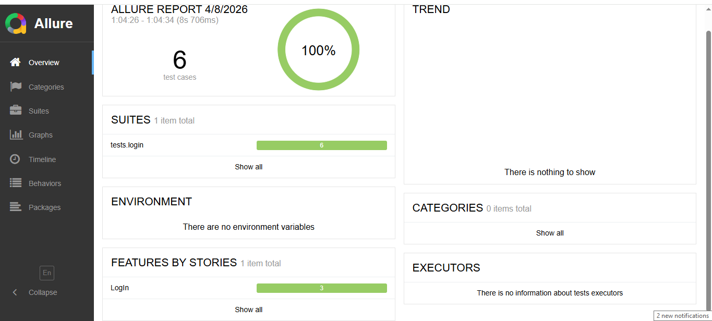

# 🧪 UI Test Automation Framework (Playwright + Pytest)

## 📌 Overview

This project is a UI test automation framework built using **Python**, **Playwright**, and **Pytest**.
It follows best practices such as **Page Object Model (POM)**, **data-driven testing**, and clean scalable architecture.

---

## 🚀 Features

* ✅ Positive login test (valid credentials)
* ❌ Negative login tests (invalid credentials)
* 🔒 Locked user scenarios
* 📊 Allure reporting integration
* 📁 Data-driven testing using JSON files
* 🔐 Environment variables support (.env)
* 🧱 Modular framework structure

---

## 🏗️ Tech Stack

* Python
* Pytest
* Playwright
* Allure Report

---

## 📂 Project Structure

```
tests/
 ├── login/
 │    ├── test_login_positive.py
 │    ├── test_login_negative.py
 │    └── test_locked_users.py

configs/
 └── test_data/
      ├── configuration.json
      └── locked_profiles.json

pages/
framework/
```

---

## ⚙️ Setup

Install dependencies:

```
pip install -r requirements.txt
playwright install
```

Create `.env` file in project root:

```
LOGIN_USERNAME=standard_user
LOGIN_PASSWORD=secret_sauce
```

---

## ▶️ Run Tests

Run all login tests:

```
pytest tests/login --alluredir=allure-results
```

---

## 📊 Allure Report

Generate and open report:

```
allure serve allure-results
```

---

## 🧠 Key Concepts

* Page Object Model (POM)
* Pytest Fixtures
* Parametrization
* Separation of test data and logic
* Scalable test design

---

## 📈 Future Improvements

* Add cart and checkout test coverage
* CI/CD integration (GitHub Actions)
* Docker support

---

## 📸 Report Preview



> Example Allure report generated after test execution
